<h1 align="center">Ecommerce Website</h1>

<h3 align="center">People can buy different types of  online product using this website.
</h3>

## Customer

### A costomer will land in our front page first and can see some of our product .Then by clicking shop in nav bar they will get different types of product category and they can find their expected product easily from there.After reaching in a spacific product category page a customer will get the option to view a product's single page or add to cart by simply hover over on a product .In single page customer will be able to set the quantity of this product or simply add this product to his wishlist .Here anyone is able to add a review for this product just for once but for that he have to login first otherwise he can just see other review.  
### Here a customer is free to add different types of product in different quantity.In cart page a customer will see details of his ongoing shopping and if that customer feels like he dome he can click on chechout which will redirect him to login,register page.After login he will be redirected to Checkout page and there he have to full fill the billing details if he is shopping here for the first time otherwise his billing details will de displayed and he can edit if wants. Only cash on delivery payment method is available now ,after clicking paynow the customer will be redirected into his 'My Account' page.There he is able see all his info in a nice way , also view or cancel all his order.For cancelling any order castomer have to show a cause.

## Admin

### This [Domain/admin] will redirect into admin login page.After loggin he is able careate ,view ,update and delete, category and product.In Order page he can view all the orders details and he can process the oder among(in proceess/Dispatch/Delivered) by showing a cause .If admin wants to logout ,he can do it simply by hover over my account and there he will get logout option.Category,Product,Order ,My Account all of this will be displaied in navbar and each of this consists of different subsection in dropdown.

## ..LANGUAGE  HAVE USED..

## Design

- HTML Template 

## Development

-  PHP
-  Mysql

# How to use this application

-  Import ecomphp.sql in your database which you will find easyly on Config folder 
-  if you are on live server ,import all files in your Hosting
-  if you are on local server[Xampp Server] ,put all files on htdocs Folder [c/xampp] 

# Contact & social

- **[Facebook](https://www.facebook.com/safahait.sawon)**
- **[Github](https://github.com/Safayet-Shawn/)**
- **[Gmail:safayetshawn95@gmail.com](safayetshawn95@gmail.com)**
- **[Phone :01726681903](01726681903)**
 
# Screenshots

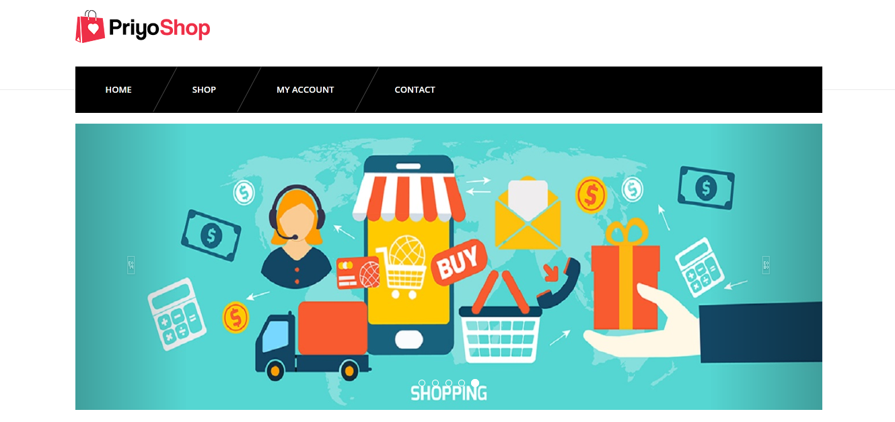

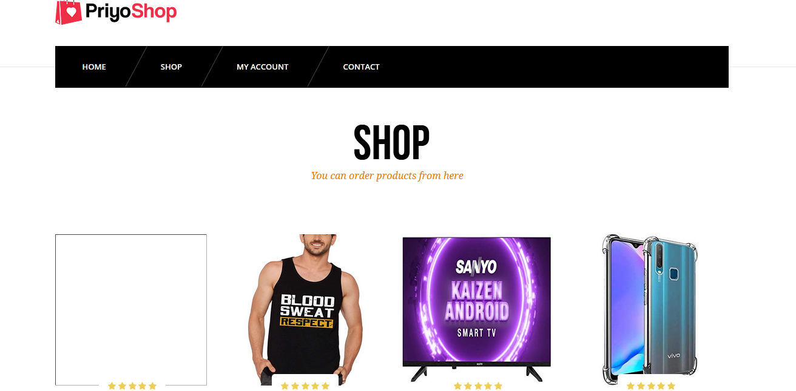

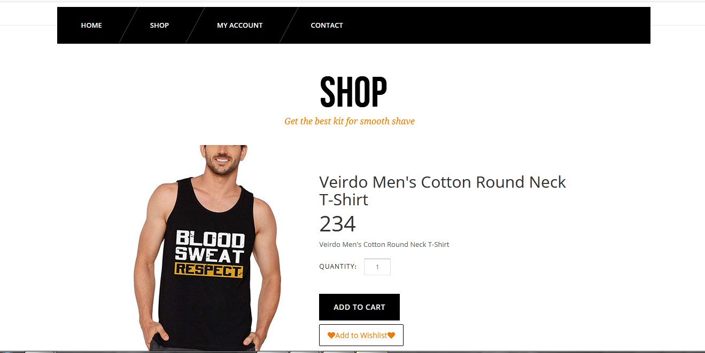

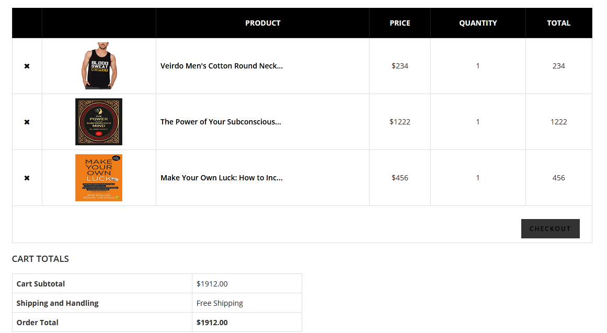

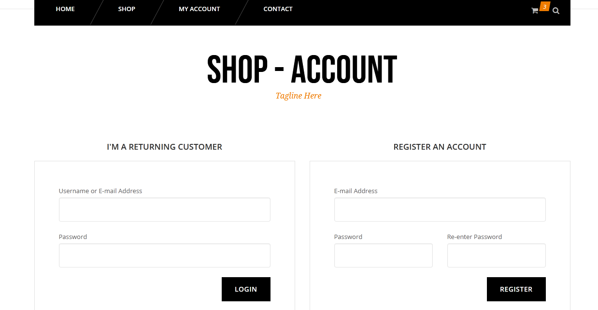

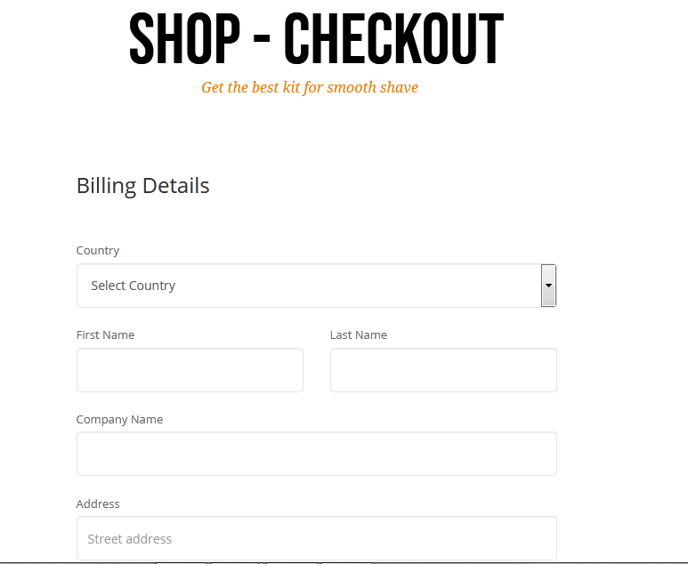

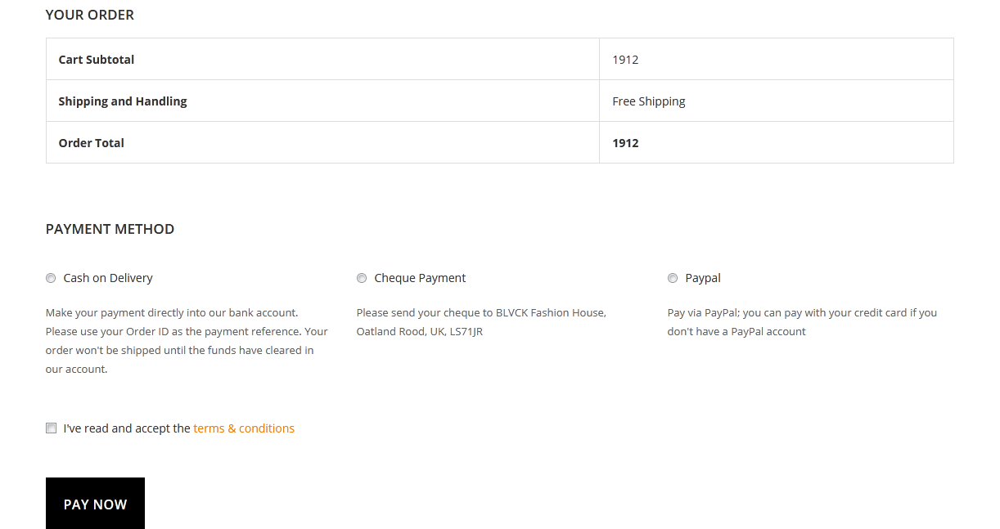

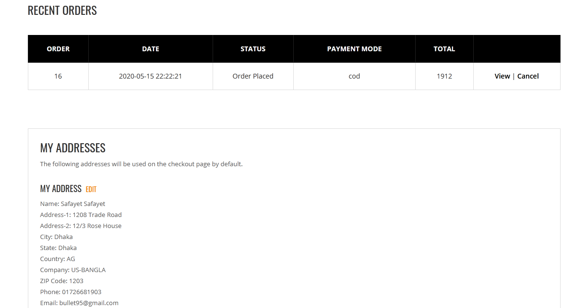

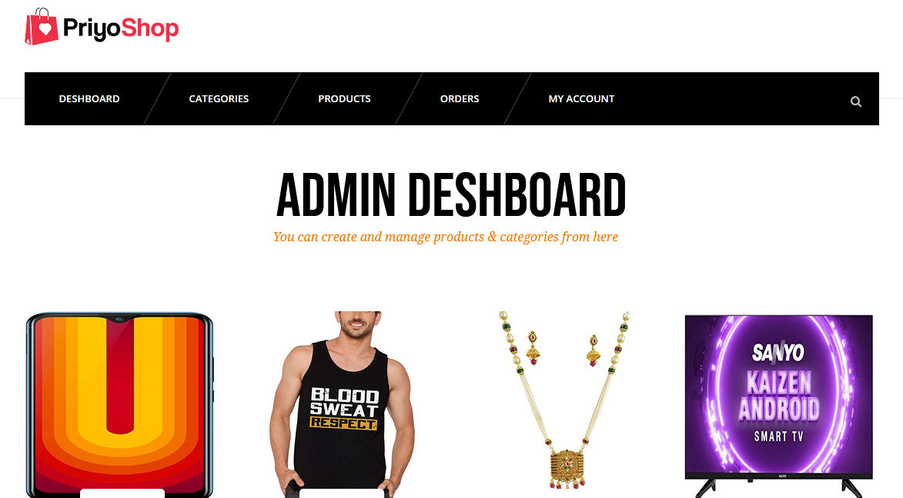

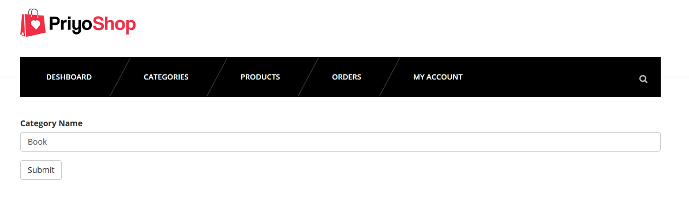

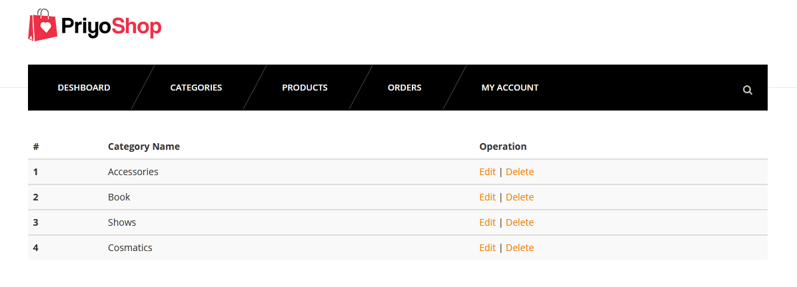

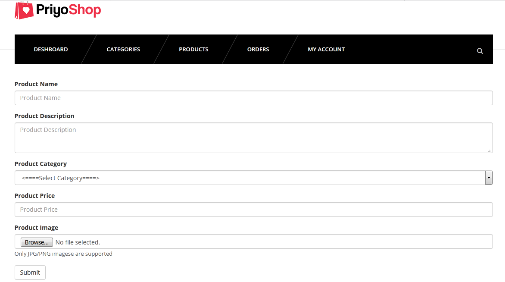

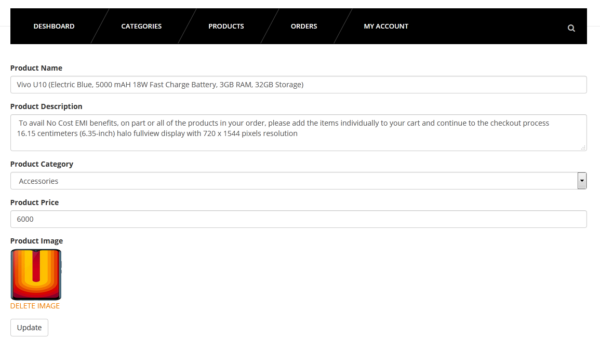

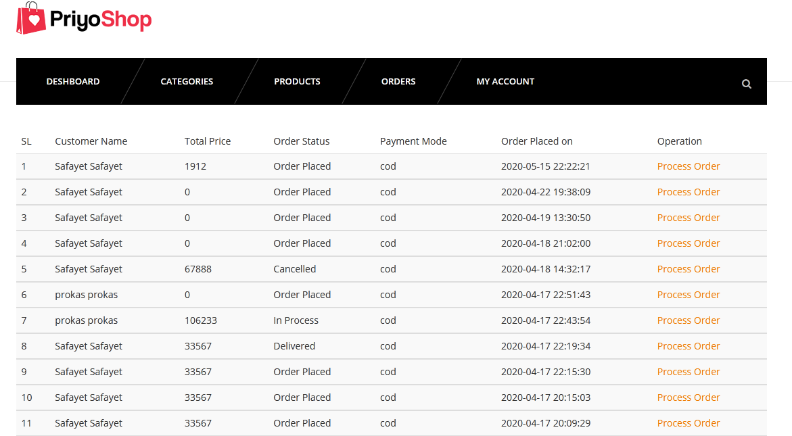

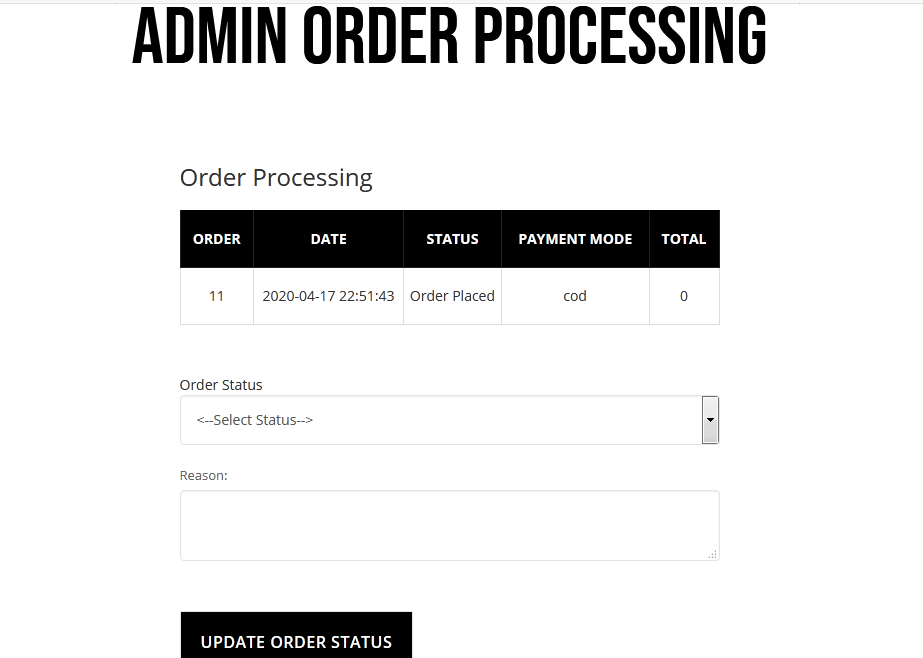
